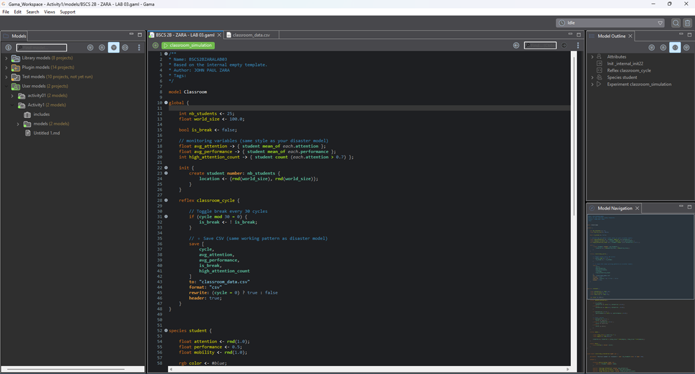
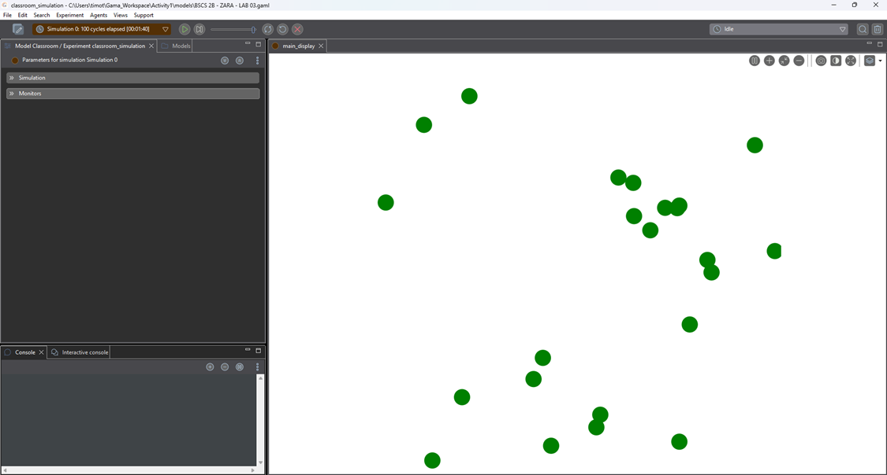
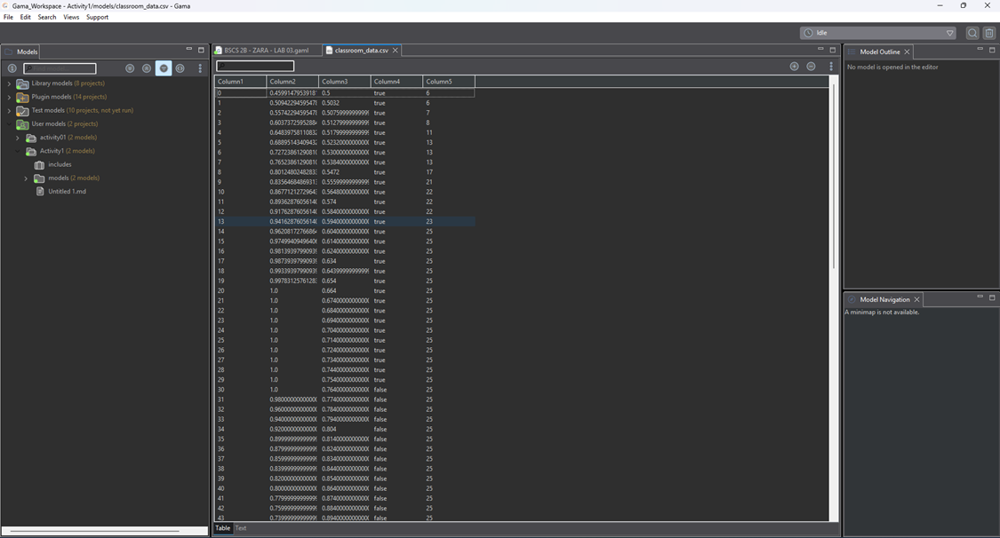
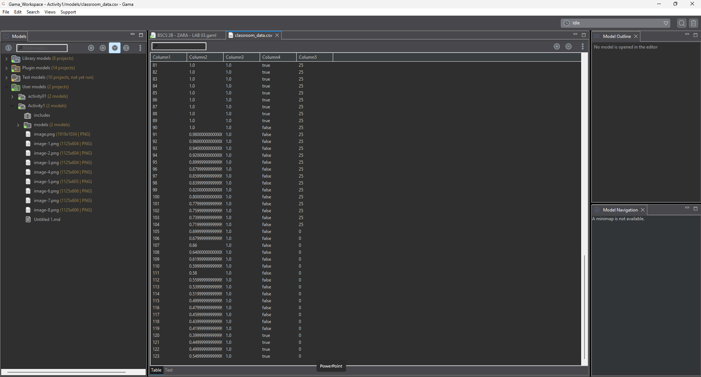
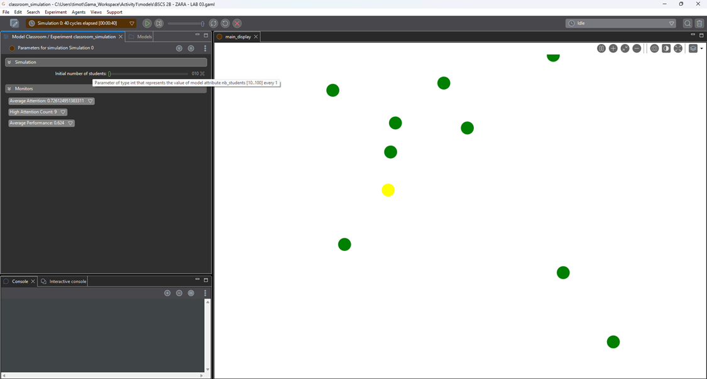
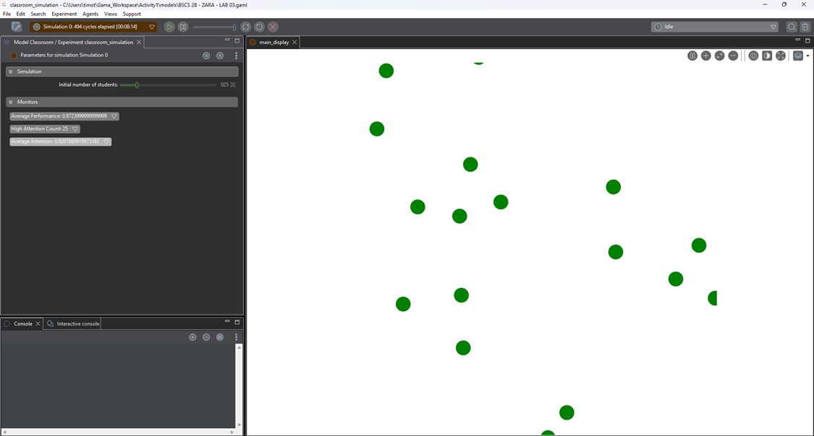
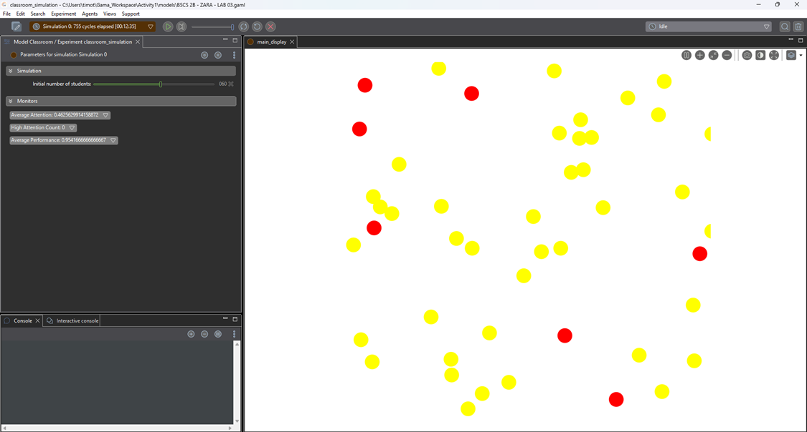
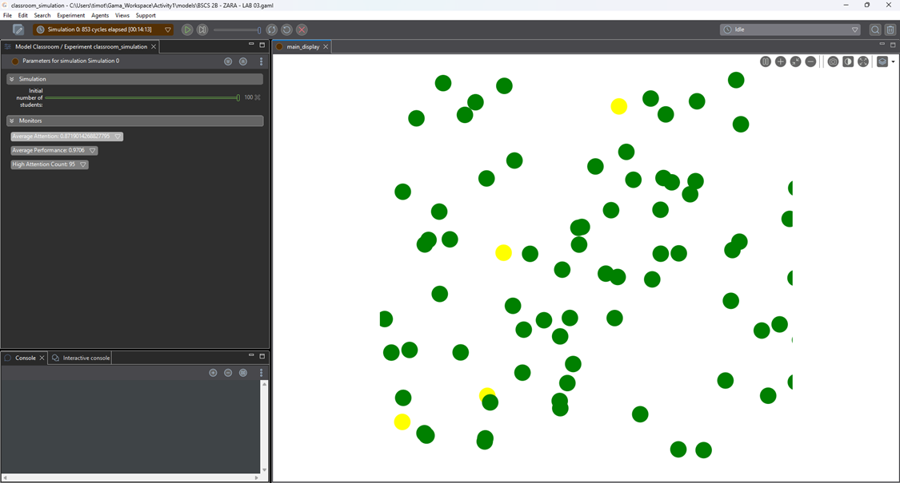
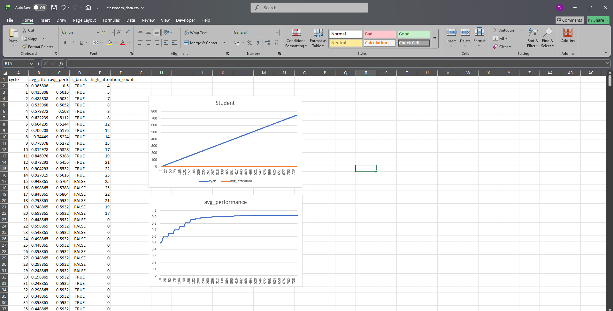
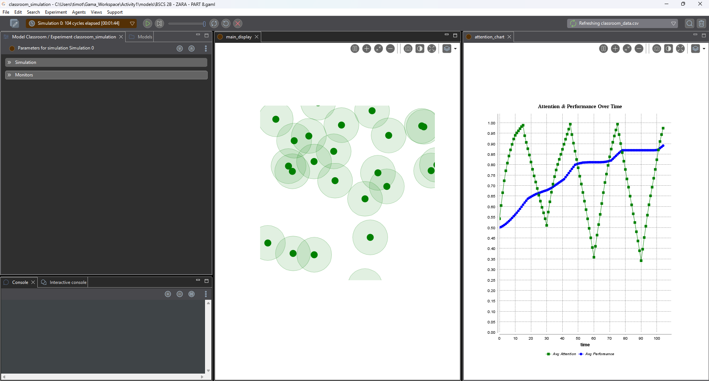

# Introduction to Intelligent Systems
# Modeling Student Attention and Performance Using Agent-Based Simulation
# John Paul C. Zara| BSCS 2B | CSEL 302

# > PART 1 - Pre-Lab Concept Questions

1.	What is an agent in an Agent-Based Model? 
  -- An agent in an Agent-Based Model is an individual object or character in the model that can act and make decisions on its own. Agents can have individual behavior and characteristics. For example, in our day-to-day world, an example of an agent in an Agent-Based Model can be a student in a classroom. All students in a classroom can have individual behavior. Some students can be very attentive to what the teacher is saying, while some students can even get distracted and talk with friends. In an Agent-Based Model, all students in the classroom can be taken as individual agents, and they can change their behavior depending on the situation in the classroom.

2.	What is the difference between: 
# 	Global Variables 
  --	Global variables are those variables that are applicable to the whole system or environment. These are variables that are shared by all agents in the model, and every individual has the same value for these variables.
# 	Species Variables
  --	Species variables are variables that are unique to every individual in the model. This means every individual has unique values for these variables.

3.	What does this expression mean? 
student mean_of each.attention 
  -- I understand this expression shows as getting the average attention level of all students in the class. The model checks the attention value of every student and then calculates the average to see how focused the whole class is.
- student – this refers to all the students in the model or class.
- mean_of – this means to calculate the average.
- each    – this means the model checks every student one by one.
- . (dot) – this is used to connect the student to their variable.
- attention – this is the variable that shows how focused a student is during class.

4.	What happens if attention continuously decreases without a break? 
  -- If attention continues to decrease, then it will eventually reach a state where its value will be zero or a very low number. This means that, in the simulation, the students (agents) will become completely inattentive, i.e., they will no longer be focused on the lesson.

# > PART 2 - Run the Base Model 
- Step 1 - Run the provided model. 

- Step 2 Observe: 
•	Student movement 
•	Color changes 
•	Monitor values 

- Step 3 - Open the generated file: classroom_data.csv 

# > PART 3 - Data Observation Table 

Fill in the table after 100 cycles: 
| **Metric**                | **Value**          |
| ------------------------- | ------------------ |
| Average Attention         | 0.8000000000000003 |
| Average Performance       | 1.0                |
| High Attention Count      | 25 students        |
| Number of Breaks Occurred | 2 breaks           |

# > PART 4 - Guided Code Analysis  
 
# Activity 1: Break Frequency Original code: 
if (cycle mod 30 = 0) 
 
Task: 
Change break interval to: 
15 cycles 
 
Questions: 
1.	Does attention increase faster? 
  -- Yes. Attention increases faster because the break happens more often. During breaks, the student's attention increases. Therefore, the more breaks there are, the faster the attention increases.
2.	Does performance grow faster? 
  --	Yes, performance can grow faster. This is because the more the attention increases, the more the condition "attention > 0.6" is satisfied. This allows the performance to increase faster.
3.	Is the system more stable? 
  -- Yes. This is so because the attention does not get too low before a break happens.

# Activity 2: Attention Decay Rate Original: 
attention <- max(0.0, attention - 0.02); 
 
Task: 
Change decay rate to: 
0.05 
 
Observe: 
1.	Does attention collapse? 
  --	Yes, attention decreases faster because the rate is higher. Students lose attention faster during class time.

2.	Does performance still improve? Explain why. 
  --	Performance improves slowly or may not improve much. This is because attention decreases faster, and the condition attention > 0.6 is not easily satisfied.

# Activity 3: Performance Growth Condition Original: 
if (attention > 0.6) 
 
Task: 
Change threshold to: 
0.8 
 
Questions: 
3.	Does performance improve slower? 
  --	Yes. The performance improves slower since the students now require a higher attention (0.8) before their performance improves.
4.	What does this represent in real classroom settings? 
  --	This represents that students require a lot of concentration before their learning performance improves. The student's performance does not improve when they are only slightly attentive.

# > PART 5 — Experiment: Class Size Impact (30 minutes) Use parameter: Initial number of students Test: 
| **Students** | **Avg Attention** | **Avg Performance** |
| ------------ | ----------------- | ------------------- |
| 10 	         |0.9909974207449588 |        1.0          | 
| 25 	         |0.9287880919973182 | 0.9723999999999999  | 
| 60 	         |0.4625629914158872 | 0.9541666666666667  | 
| 100          |0.8719014268827795 |       0.9706        | 

Analysis Questions: 
1.	Does increasing class size affect average attention? 
-- Yes. This is based on the results obtained, where it is clear that increasing the class size may affect average attention. This is due to the increase in the number of students, where sometimes the average attention is likely to reduce due to increased movement in the simulation. For example, when the number of students increased to 60, average attention was significantly low.
2.	Does mobility create more randomness? 
-- Yes. This is due to the increased movement of students in different directions randomly, where it is not possible to predict the behavior of students in this simulation. This is based on the movement of students, where average attention is likely to vary in different ways.
3.	Is emergent behavior visible? 
-- Yes. This is based on the patterns that are likely to emerge due to increased movement of students in this simulation. This is based on the changes that are likely to be observed in average attention based on the increased number of students in this simulation, where each student is likely to behave in a simple way but the average performance is likely to be complex.

# > PART 6 — Data Analysis Task (Optional Python) 
Using Excel or Power Query Editor 1. Load classroom_data.csv 
2. Plot: 
o 	Attention vs Cycle o 	Performance vs Cycle 
3.	Identify break cycles. 
4.	Compute correlation between attention and performance. 

 
Question: 
Is performance strongly dependent on attention? 
  -- Yes, performance strongly depends on attention, and the data proves it. When students are on break and their attention goes up, their performance goes up too at the same time. This happens because in the simulation, a student can only improve their performance when their attention is above 0.8 so if a student is not focused enough, their performance simply does not move at all, it just stays frozen at the same number. Think of it like a locked door where attention is the key you cannot open the door to better performance unless your attention is high enough to unlock it first. And when the break ends and attention starts dropping, performance immediately stops improving and flatlines, proving that without attention, there is zero progress in performance.

# > PART 7 - Critical Thinking Questions 
1.	Why does performance only increase when attention > 0.6? 
  --	The performance increases only when attention is greater than 0.6 because the model is based on the idea that students need to be attentive before they can perform well. If the students are not attentive, they may not understand what is being taught to them.

2.	Is this model deterministic or stochastic? 
  --	The model is stochastic because it is based on random numbers. For example, the attention and mobility are based on the function rnd(), which means that random numbers are generated for the students. Therefore, the results of the simulation can be different each time the program is run.

3.	What real-world classroom factors are missing? 
•	The real-world classroom factors that are not considered in the model are:
  -- The teaching style of the teacher
  -- The motivation of the students
  -- The interaction of the students with one another
  -- The noise in the classroom
  -- The learning abilities of the students

4.	How would peer influence affect the system? 
  --	Peer influence may make the system more interactive. For instance, a child may be around people who are very attentive. This may make the child more attentive. However, the child may be around people who are distracted. This may make the child less attentive.
 
# > PART 8 — Advanced Extension Tasks (Choose One) 
# Option A: Peer Influence Add logic: (choosen a)
5.	Students near high-attention peers increase attention. 

Explanation: 
	-- This shows that Every cycle, each student looks around within a set radius to find nearby classmates, counts how many of those classmates have a high attention level above 0.7, and if there is at least one highly focused peer nearby, that student receives a small attention boost scaled by how many high-attention peers are surrounding them meaning the more engaged classmates a student is sitting close to, the more their own attention rises this boost is always capped at 1.0 so it never goes beyond the maximum, and the effect is visualized on screen through a faint transparent ring drawn around each student that represents their influence zone, so whenever two students' rings overlap, those two students are actively pulling each other's attention upward, creating a ripple effect where one focused student can gradually lift the attention of everyone sitting nearby.

 
Option B: Teacher Agent 
Add a teacher species that: 
6.	Increases nearby students attention. 
7.	Reduces mobility. 
 
Option C: Fatigue Model Add: 
8.	If attention < 0.3 for 10 cycles → performance decreases. 
 

