# Assessment Task No. 4 — CSEL302
## Topic: Agent Behaviors and Reflexes in Agent-Based Systems
**Course:** Introduction to Intelligent Systems | **Term:** 2nd Semester | **Academic Year:** 2025-2026
# John Paul C. Zara | BSCS 2B | CSEL 302

---

## PART 1 — Simulation Scenario

Each **student agent** has the following attributes:

| Attribute | Description | Starting Value |
|-----------|-------------|---------------|
| energy | ability of the student to participate | 5 |
| score | participation score | 0 |
| status | active or inactive | "active" |

**Rules:**
- Students may participate in class.
- When participating: score increases by 1, energy decreases by 1.
- When energy reaches 0, the student becomes inactive.

---

## PART 2 — Step 1: Create the Model

Create a new GAMA model file named `classroom_simulation.gaml` and start with:

Proof of Output: 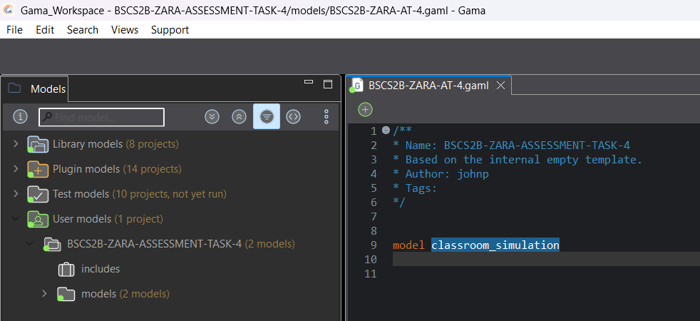

---

## PART 3 — Step 2: Define the Student Agent

```gaml
species student {
    int energy <- 5;
    int score <- 0;
    string status <- "active";

}
```
> **Outcome:** This creates a blueprint for every student. `int` means whole number, `string` means text, and `<-` assigns the starting value. Every student starts with energy=5, score=0, status="active", and added rgb of "purple" to show as active.
Proof of Output: 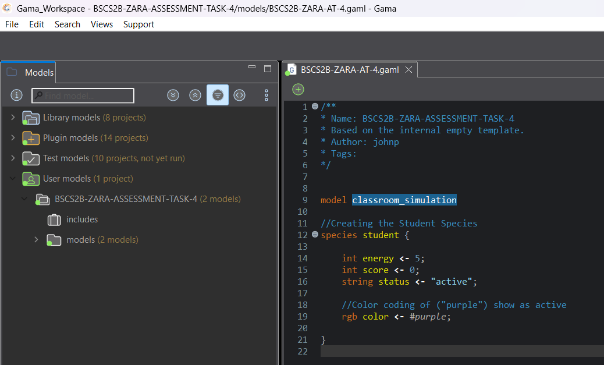

---

## PART 4 — Step 3: Add Behavior (Participation)

```gaml
reflex participate when: status = "active" {
    if flip(0.4) {
        score <- score + 1;
        energy <- energy - 1;
    }

}
```
> **Outcome:** The `when: status = "active"` condition means this only runs if the student is still active. `flip(0.4)` gives a **40% chance** of participation each step. When it fires, score goes up by 1 and energy goes down by 1.
Proof of Output: 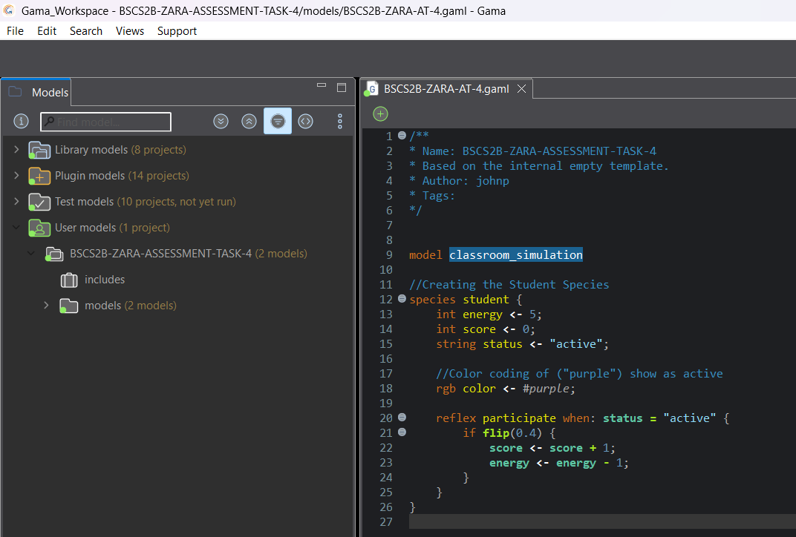

---

## PART 5 — Step 4: Add Reflex for Status Update

```gaml
reflex update_status {
    if energy <= 0 {
        status <- "inactive";
    }

}
```
> **Outcome:** This constantly checks if energy has dropped to 0. If so, the student becomes "inactive" and the `participate` reflex will no longer trigger — because it only runs `when: status = "active"`.
Proof of Output: 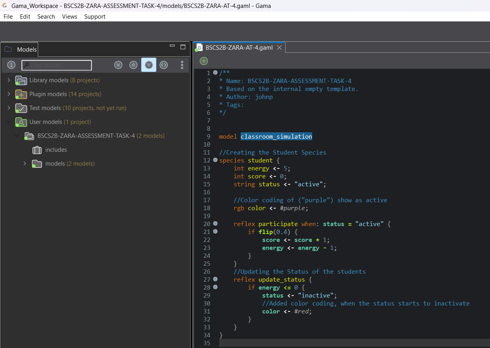

---

## PART 6 — Step 5: Create the Environment

```gaml
global {

    init {
        create student number: 20;
    }

}
```
> **Outcome:** The `global` block is the world/environment of the simulation. The `init` section runs once at the start. `create student number: 20` spawns 20 student agents, all using the blueprint defined in the species block.
Proof of Output: 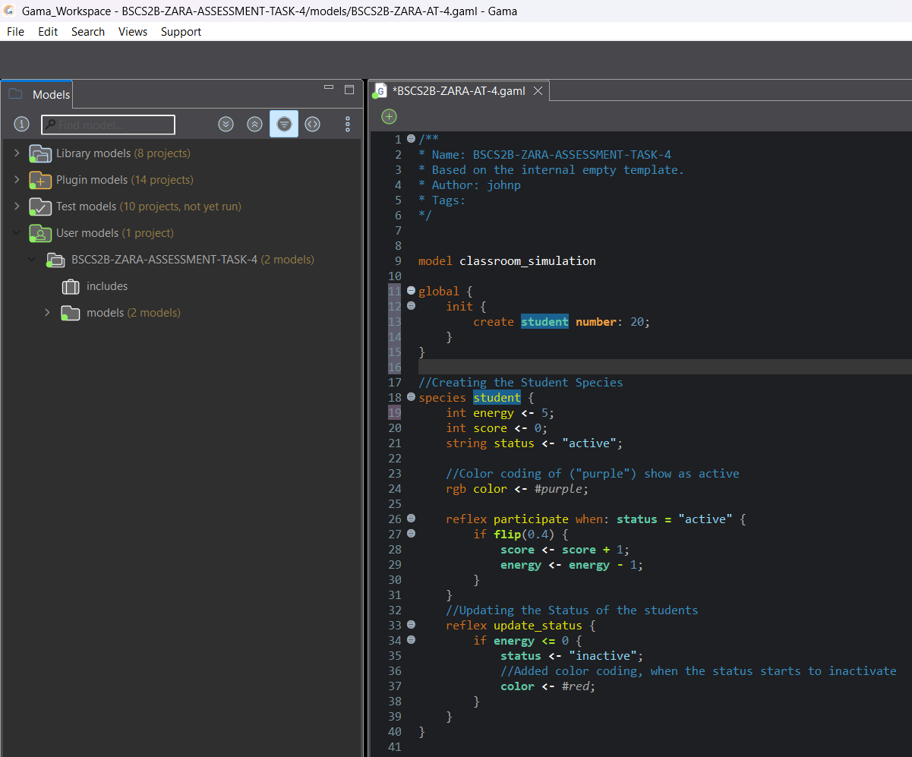

---

## PART 7 — Step 6: Run the Simulation
- I have added, Live dashboard values — these update every step so you can watch the average score, average energy, and number of inactive students change in real time as the simulation runs.

Proof of Output: 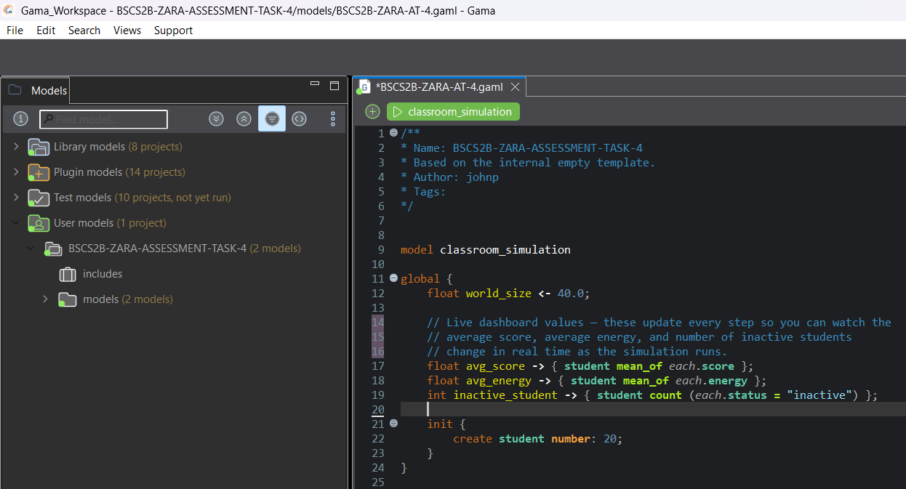
- Then added Aspect definition inside the Student species. This aspect makes every student appear as a small circle, colored according to their current color attribute. Purple when active, red when inactive.

Proof of Output: 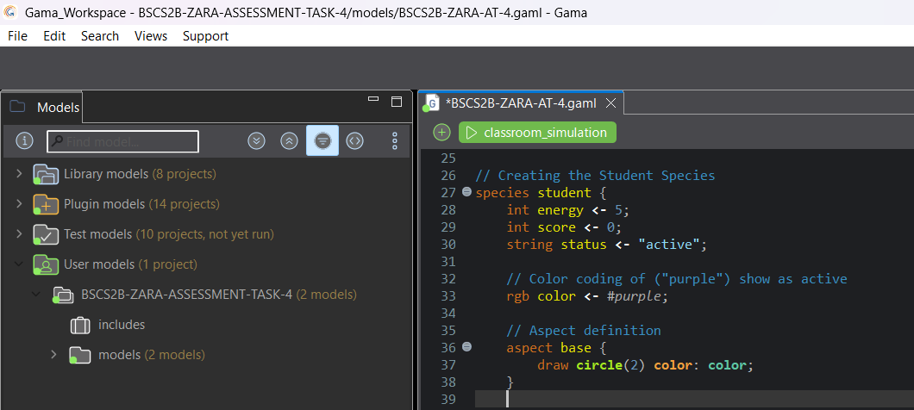
- Then, What is the `experiment classroom_simulation type: gui`? This shows that it opens the visual window so you can see students as colored circles, and without it the simulation runs invisibly.
- Then lastly, `What are the Live Dashboard Values`? This shows the three monitors act like a live scoreboard updating every step, with a breakdown of what each one (avg_score, avg_energy, inactive_student).

Proof of Output: 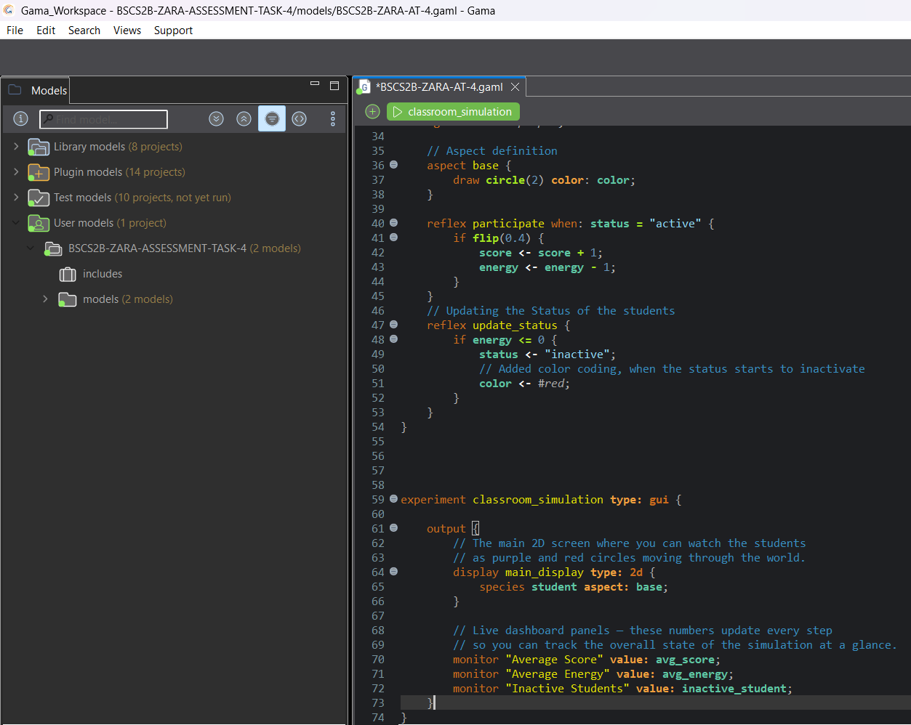

> **Outcome:** The simulation ran successfully with 20 student agents appearing as purple circles that turned red once their energy reached zero. The live dashboard updated in real time showing the average score, average energy, and inactive student count. This demonstrated emergent behavior where each run produced different results but followed the same overall pattern of gradual student depletion. 

Observe the following:
- Which students participate the most
- How energy changes over time
- When students become inactive

Proof of Output: 2D display showing a mix of purple and red circles
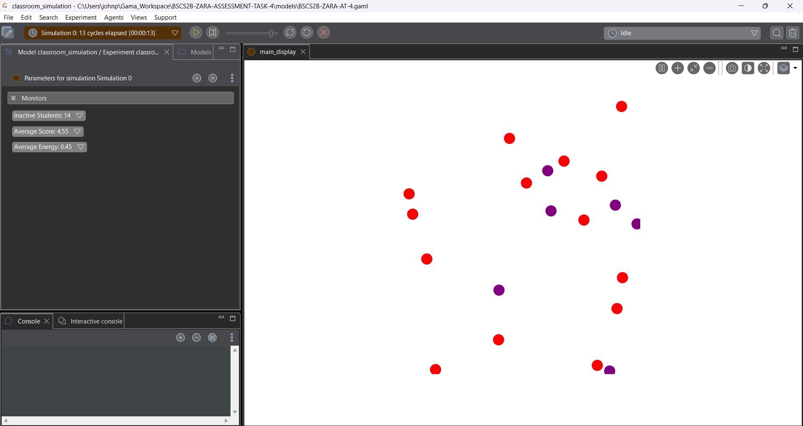
Proof of Output: 3 monitor panels showing the updated numbers
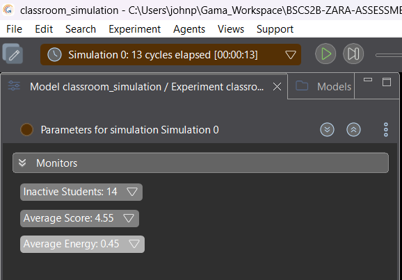
Proof of Output: End of the simulation when all circles have turned red
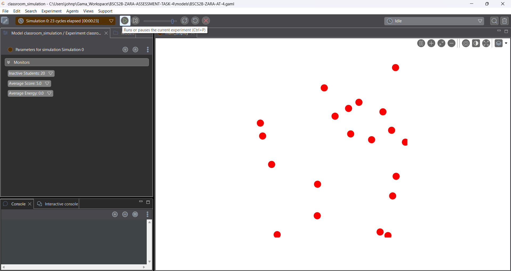


---

## PART 8 — Guide Questions & Answers
- Answer the following questions.
**Q1. What happens to students when energy reaches 0?**

When a student's energy reaches 0, the update_status reflex changes their status to "inactive" and their circle turns red on the display. Since the participate reflex only runs when: status = "active", the student completely stops participating for the rest of the simulation.

---

**Q2. How does participation affect score and energy?**

Every time a student participates, their score goes up by 1 but their energy goes down by 1. So the more a student participates, the higher their score gets, but at the same time they run out of energy faster and become inactive sooner.

---

**Q3. If participation probability increases to 0.8, what happens?**

If I change flip(0.4) to flip(0.8), students will have an 80% chance of participating every step instead of 40%. This means they gain score much faster but also lose energy much quicker, so all students will turn red and become inactive a lot sooner than before.
Proof of Outcome: 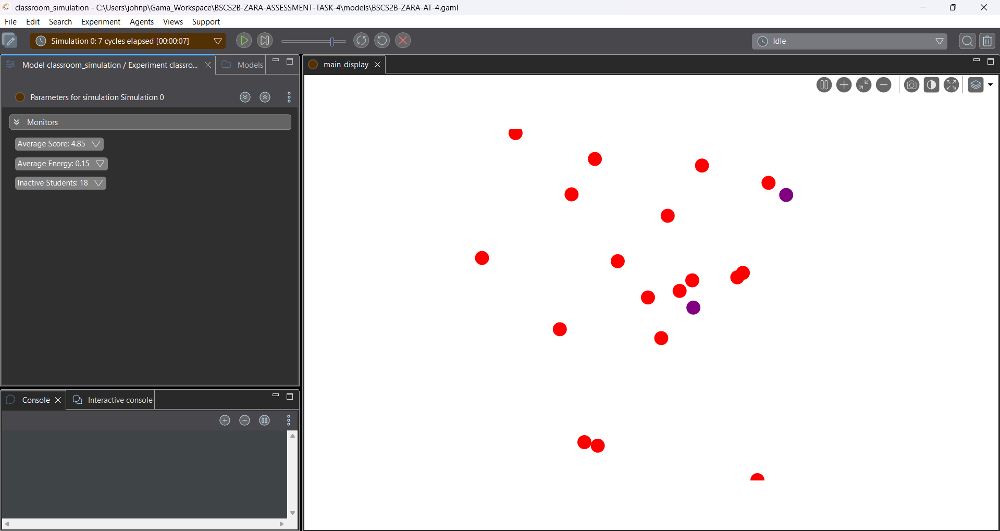
---

**Q4. What pattern do you observe in the simulation?**

I observed that at the start most students are purple and active, but over time they slowly turn red as their energy runs out. Not all students become inactive at the same time because participation is random, so some last longer than others. This shows emergent behavior where the same simple rules produce slightly different results every time the simulation runs.

---

## Simulation Behavior Explanation:

The simulation runs 20 student agents, each starting with 5 energy and a score of 0. Every step, active students have a 40% chance of participating which increases their score but decreases their energy. Once a student hits zero energy they turn red and stop participating completely. I noticed that students burn out at different times due to the randomness of participation, giving each student a different final score. This shows how complex and varied outcomes can come from a simple set of rules applied to many agents at once.

---

